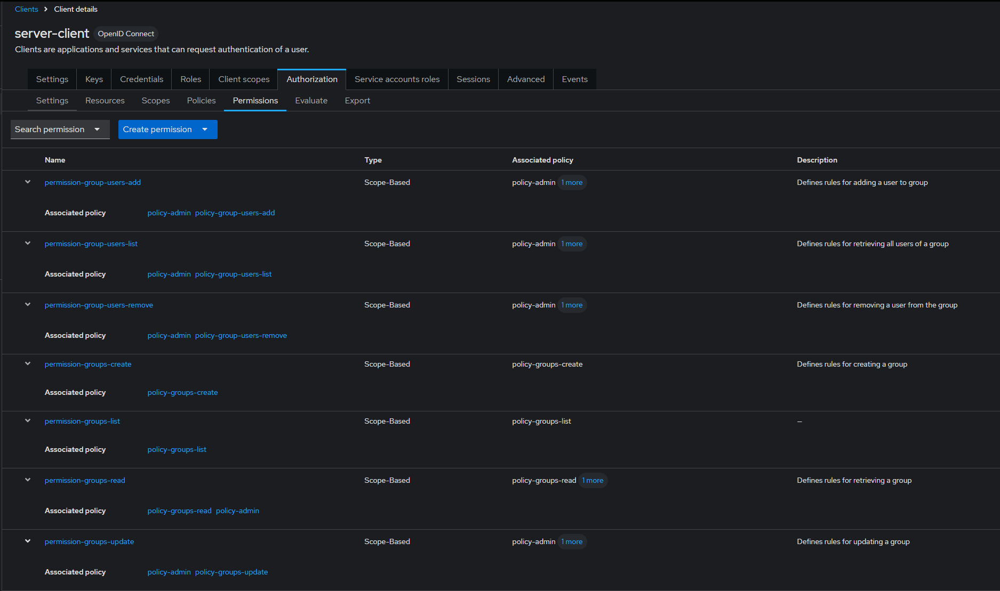
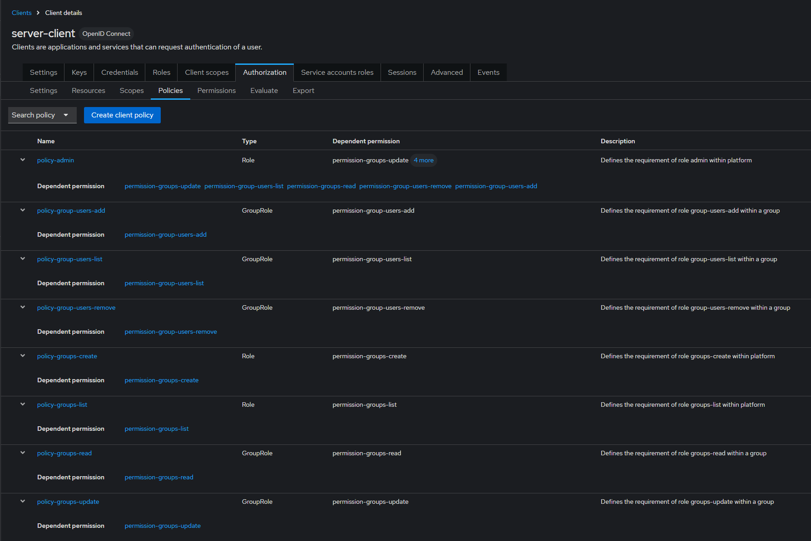
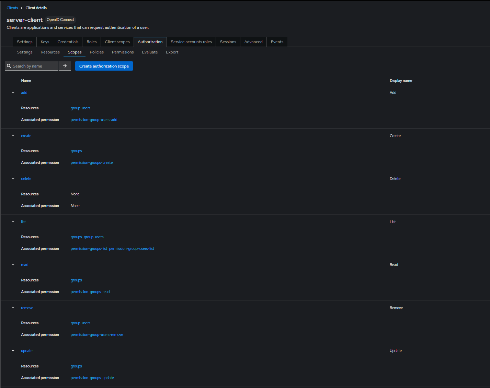
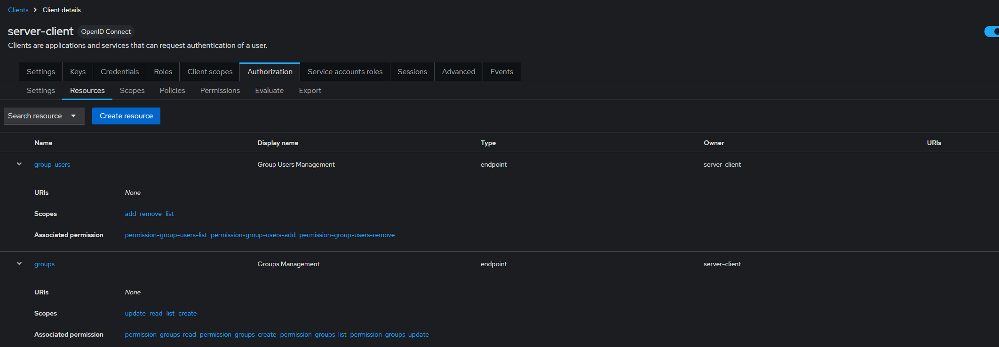

| Platform Role (Realm Roles) | Associated Role (Client Role) |
| --------------------------- | ----------------------------- |
| admin                       | groups-create                 |
|                             | groups-list                   |

| Platform Role (Realm Roles) | Associated Role (Client Role) |
| --------------------------- | ----------------------------- |
| user                        |                               |

| Platform Role (Realm Roles) | Associated Role (Client Role) |
| --------------------------- | ----------------------------- |
| group-admin                 | group-users-list              |
|                             | group-users-add               |
|                             | group-users-remove            |
|                             | group-users-update            |
|                             | groups-read                   |
|                             | groups-update                 |

| Platform Role (Realm Roles) | Associated Role (Client Role) |
| --------------------------- | ----------------------------- |
| group-member                | group-users-list              |
|                             | groups-read                   |

Role Policy Types

### GroupRole

Requires the role {roleName} within a specific group. Example, to see users from group A, you should have the role group-users-list inherited from group A. If you have group-users-list in group A, and try to access group B users, the access is forbidden.

### Role

Requires the role {roleName} within the platform. Example, to see users from group A, you need role admin within platform. With this role, you can see group A and B users.

Decision Strategies

**Affirmative** means that at least one policy must evaluate to a positive decision in order for the final decision to be also positive.

**Unanimous** means that all policies must evaluate to a positive decision in order for the final decision to be also positive.

**Consensus** means that the number of positive decisions must be greater than the number of negative decisions. If the number of positive and negative is the same, the final decision will be negative.

| Endpoint                                            | Permission Type | Resource    | Scope  | Policies                                             | Decision Strategy |
| --------------------------------------------------- | --------------- | ----------- | ------ | ---------------------------------------------------- | ----------------- |
| GET /groups                                         | scoped          | groups      | list   | **Role:** groups-list                                | Unanimous         |
| POST /groups                                        | scoped          | groups      | create | **Role:** groups-create                              | Unanimous         |
| GET /groups/{groupId}                               | scoped          | groups      | read   | **GroupRole:** groups-read or **Role:** admin        | Affirmative       |
| PUT /groups/{groupId}                               | scoped          | groups      | update | **GroupRole:** groups-update or **Role:** admin      | Affirmative       |
| GET /groups/{groupId}/users                         | scoped          | group-users | list   | **GroupRole:** group-users-list or **Role:** admin   | Affirmative       |
| POST /groups/{groupId}/users/{userId}               | scoped          | group-users | add    | **GroupRole:** group-users-add or **Role:** admin    | Affirmative       |
| DELETE /groups/{groupId}/users/{userId}             | scoped          | group-users | remove | **GroupRole:** group-users-remove or **Role:** admin | Affirmative       |
| PUT /groups/{groupId}/users/{userId}/roles/{roleId} | scoped          | group-users | update | **GroupRole:** group-users-update or **Role:** admin | Affirmative       |

\*\* Images might be outdated as it requires to much hasle to update for each new permission

### Permissions

### Policies

### Scopes

### Resources

